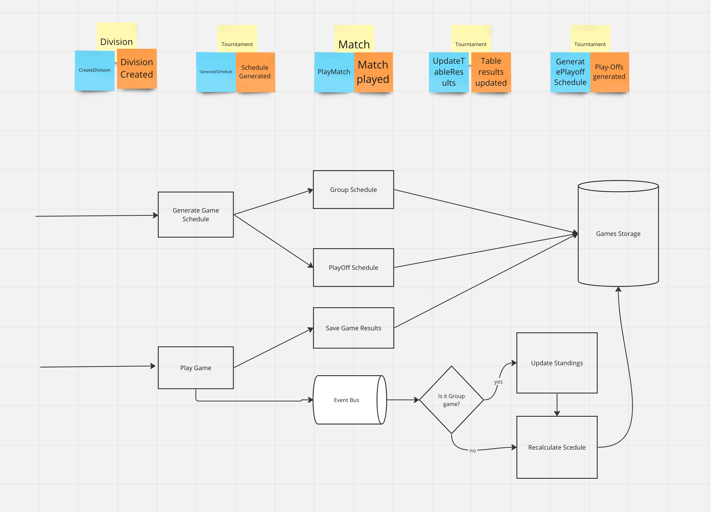
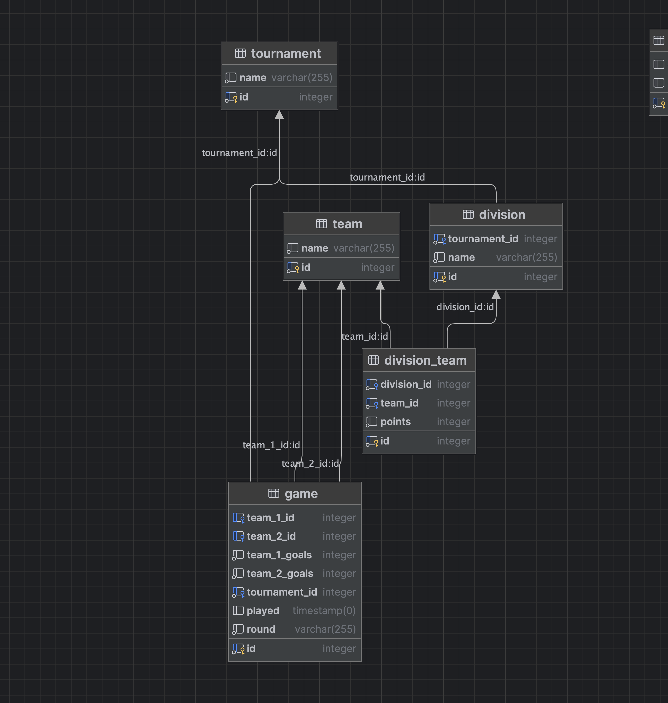

# Symfony Test Task

## Getting Started

1. If not already done, [install Docker Compose](https://docs.docker.com/compose/install/) (v2.10+)
2. Run `docker compose build --no-cache` to build fresh images
3. Run `docker compose up --pull always -d --wait` to start the project
4. Open `https://localhost` in your favorite web browser and [accept the auto-generated TLS certificate](https://stackoverflow.com/a/15076602/1352334)
5. Run `docker compose down --remove-orphans` to stop the Docker containers.

## Features
* Before starting the game you need to create tournament, divisions and teams
* Main App logic is in `src/Game/*`
* There are 2 main UI controls - `create_schedule` and `play_game` in `src/Controller/GameController.php`
* `create_schedule` will generate schedule for all divisions and playoffs in tournament
* `play_game` will play game and update score for teams and divisions

### Brainstorming

### DB Schema

## NOT IMPLEMENTED (yet?)
1. Tests
2. Validations
3. Error handling
4. Could be buggy :) 
5. Endgame conditions
6. UI
7. ...

**Enjoy!**
